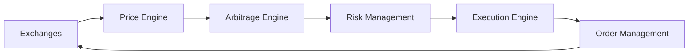

# Crypto Arbitrage Platform Architecture

## Overview

The platform is built on a microservices architecture with the following main components:

### 1. Core Services

#### Price Engine
- Real-time price monitoring
- WebSocket connections to exchanges
- Price normalization and validation

#### Arbitrage Engine
- Opportunity detection
- Multi-strategy support
- ML-based prediction

#### Risk Management
- Position sizing
- Risk assessment
- Exposure management

#### Execution Engine
- Order management
- Smart order routing
- Execution optimization

### 2. Data Flow



### 3. Machine Learning Pipeline

- Feature Engineering
- Model Training
- Real-time Prediction
- Performance Monitoring

### 4. Monitoring & Analytics

- Real-time Dashboards
- Performance Metrics
- Risk Analytics
- Trade History

## Deployment

The platform uses Docker containers orchestrated with Docker Compose:

```yaml
services:
  - price-engine
  - arbitrage-engine
  - risk-management
  - execution-engine
  - ml-predictor
  - monitoring
  - database
  - cache
```

## Scaling Considerations

1. Horizontal Scaling
   - Price engine can be scaled per exchange
   - Multiple arbitrage engines for different strategies
   - Distributed risk management

2. Performance Optimization
   - In-memory caching
   - Database sharding
   - Message queues for async processing